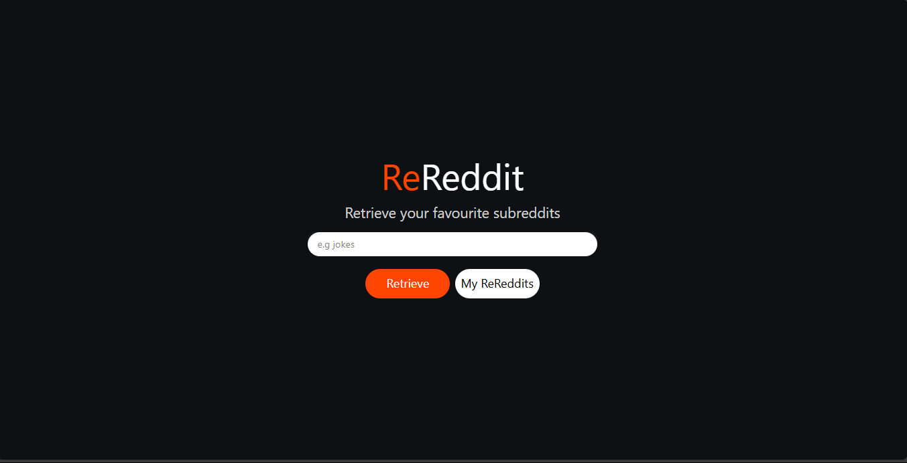
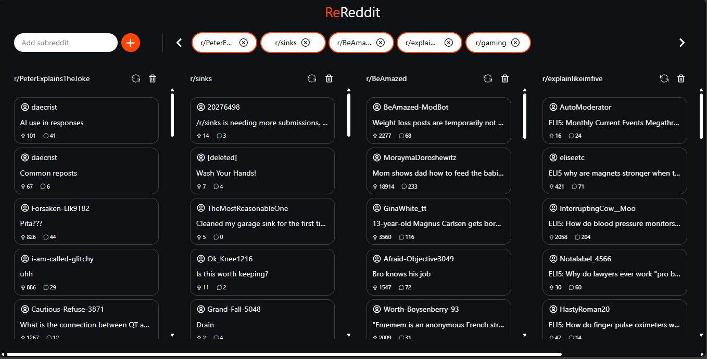

# ReReddit

A modern, animated web app to search, save, and browse your favorite subreddits with instant suggestions and smooth navigation.

> **This project was created for [roadmap.sh](https://roadmap.sh/)!**  
> View it on the roadmap.sh projects page: [https://roadmap.sh/projects/reddit-client](https://roadmap.sh/projects/reddit-client)

## Live Demo

Check out the deployed app here: [rereddit-az.vercel.app](https://rereddit-az.vercel.app)

## Screenshots

### Home Page



### Saved ReReddits



## Features

- 🔍 **Search Subreddits:** Type to get instant suggestions from popular subreddits.
- 💾 **Save Subreddits:** Add subreddits to your collection for quick access.
- 🗑️ **Remove Subreddits:** Easily remove subreddits from your saved list.
- 🌀 **Animated UI:** Smooth transitions and feedback using [Motion](https://www.motion.dev).
- 📦 **Persistent Storage:** Your saved subreddits are stored in your browser (localStorage).
- 📱 **Responsive Design:** Works great on desktop and mobile.

## Tech Stack

- [React](https://react.dev/)
- [TypeScript](https://www.typescriptlang.org/)
- [Vite](https://vitejs.dev/)
- [Framer Motion](https://www.framer.com/motion/)
- [React Router](https://reactrouter.com/)
- [Tailwind CSS](https://tailwindcss.com/) (assumed from class names)

## Getting Started

1. **Clone the repository:**

```sh
git clone https://github.com/yourusername/rereddit.git
cd rereddit
```

2. **Install dependencies:**

```sh
npm install
```

3. **Run the development server:**

```sh
npm run dev
```

4. **Open in your browser:**
  Visit [http://localhost:5173](http://localhost:5173) (or the port shown in your terminal).

## Project Structure

```
src/
  App.tsx
  main.tsx
  InterfacesAndTypes.tsx
  Components/
  Error1.tsx
  Error2.tsx
  RedditCard.tsx
  SubredditButton.tsx
  SubredditCard.tsx
  SuggestionsList.tsx
  Context/
  QueryContext.tsx
  QueryProvider.tsx
  useQueryContext.tsx
  Pages/
  Home.tsx
  Reddits.tsx
```

- **Components/**: Reusable UI components.
- **Context/**: Global state management using React Context API.
- **Pages/**: Main pages/routes of the app.

## Credits

- Reddit API for subreddit data.
- [React Icons](https://react-icons.github.io/react-icons/) for UI icons.

---

**Enjoy using ReReddit!**